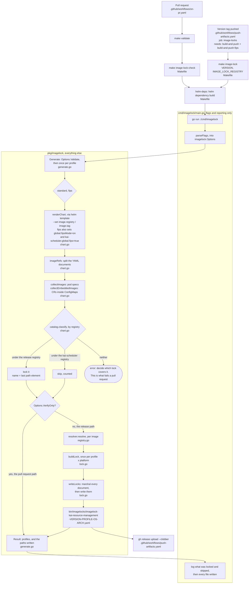
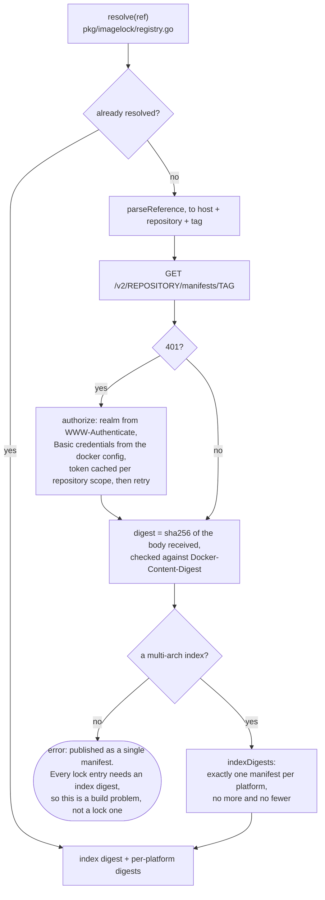

# imagelock — air-gap image lock generator

Every KAI Resource Management release publishes a digest-pinned list of the container
images this repository builds, so an air-gapped cluster can mirror exactly the bits
that release was tested with. This is the tool that writes those lists.

Its output is a set of `ImageLock` documents attached to the GitHub Release. Nothing
in the chart reads them; they are consumed before `helm install`. The user-facing
side is [Install in an air-gapped cluster](../../docs/how-to/install-in-an-air-gapped-cluster.md).

## Scope

The lock covers the five images built here, and stops there. KAI Scheduler is bundled
as a subchart, and that project publishes and pins its own images; restating its
digests would mean two records of one release that disagree the moment a tag is
re-pushed between the two generation runs. A platform-wide lock is composed from the
per-project ones rather than nested inside any of them.

Ownership follows the **registry**, not a list of image names: everything under the
release registry is locked, everything under the subchart's pinned registry is
recognised and left alone, and anything under a third registry stops the run. Two
prefixes, both stable — a service added to this chart is covered with no change here,
and a kai-scheduler bump that ships a new image needs no edit either.

That last case is the one worth keeping. A third-party image belongs to nobody's lock
until someone says so, and if "not ours" and "never heard of it" looked the same it
would reach an air-gapped site as a surprise.

## What it does

1. Renders the chart with `helm template`, once per profile.
2. Collects every container image the install would run, this repository's and the
   subchart's alike. That includes images named nowhere in a pod spec: the KRMConfig
   and the KAI Config both travel as ConfigMap text, and their operators create the
   workloads from them later. Three of this repository's own five arrive that way, so
   this step is not an edge case.
3. Classifies each reference by registry — lock it, leave it to the project that
   publishes it, or fail. Classification is fail-closed: a repository under neither
   known registry stops the release rather than shipping a lock that silently omits an
   image.
4. Resolves each locked tag to a digest per platform, over the registry API. The digest is
   computed from the manifest bytes the registry served rather than read out of its
   `Docker-Content-Digest` header, so a lock cannot name something that was not
   actually served.
5. Writes one document per profile and platform, and only once every digest is in
   hand, so a registry failure leaves no partial set behind.

## Where each step lives



Three things there are deliberate. The package never prints: `Generate` returns a
`Result` and the command decides what to say about it, so nothing but the locks is
written from inside `pkg/imagelock`. `VerifyOnly` returns before the resolver is
built, so the pull request check reaches no registry and creates no file. And
`writeLocks` marshals every document before it writes any, so a failure cannot leave
a half-written set behind for a release to pick up.

Resolving one image is the only step that leaves the machine:



| File | Responsibility |
| --- | --- |
| `Makefile` | The `image-lock` and `image-lock-check` targets, and wiring the check into `validate` |
| `.github/workflows/on-pr.yaml` | Runs `make validate`, which is how the offline check reaches a pull request |
| `.github/workflows/push-artifacts.yaml` | The `image-locks` job: generate, then attach to the GitHub Release |
| `cmd/imagelock/main.go` | Flag parsing and reporting, and nothing else |
| `pkg/imagelock/generate.go` | The public API: `Options`, `Generate`, the profile loop, the verify-only short circuit |
| `pkg/imagelock/chart.go` | Rendering the chart, finding the images, and deciding who owns each one |
| `pkg/imagelock/registry.go` | The registry client and the digest check |
| `pkg/imagelock/lock.go` | The ImageLock document, its file name, and writing the set |

## Commands

```bash
make image-lock-check                 # offline coverage check; part of `make validate`
make image-lock VERSION=v0.1.0        # write the locks into bin/imagelocks/
```

`make image-lock` reaches the registry. The published images need no credentials; a
release's own images are private until the release is, so CI runs `docker login`
first and the generator picks the credentials up from `~/.docker/config.json`.
Credential helpers are not invoked — only credentials stored inline are read.

Useful overrides:

| Variable | Default | Purpose |
| --- | --- | --- |
| `IMAGE_LOCK_REGISTRY` | `ghcr.io/kai-scheduler/kai-resource-management` | Registry the chart's own images are published to. `values.yaml` still holds the local build default, so it is passed in rather than read from the chart. |
| `IMAGE_LOCK_OUT_DIR` | `bin/imagelocks` | Where the documents are written. |

The binary takes `--platform` and `--profile` as repeatable flags if you need a
subset; by default it locks `linux/amd64` and `linux/arm64` for both the `standard`
and the `fips` profile.

`make image-lock-check` prints what it decided, so the split is visible rather than
implied:

```text
imagelock: standard: locking 5 image(s): helm-hooks, krm-operator, nodepool-controller,
  pod-group-assigner, project-controller (12 left to the kai-scheduler project)
```

## Output

```text
bin/imagelocks/
  imagelock-kai-resource-management-vX.Y.Z-standard-linux-amd64.yaml
  imagelock-kai-resource-management-vX.Y.Z-standard-linux-arm64.yaml
  imagelock-kai-resource-management-vX.Y.Z-fips-linux-amd64.yaml
  imagelock-kai-resource-management-vX.Y.Z-fips-linux-arm64.yaml
```

Five entries per file, one per image this repository builds. Each carries three
references:

- `image` — the repository at this platform's manifest digest. This is what to copy.
- `source` — the tag the chart pulls. The chart has no digest field, so the mirrored
  digest has to be published under this tag in the private registry.
- `indexDigest` — the multi-arch index the platform manifest came from. It is the
  same in both platform files, which is how you can tell they describe one release.
  It is never empty: an image published as a bare manifest rather than a multi-arch
  index is refused, because a lock entry without this field is rejected downstream.

## Two profiles

The chart selects FIPS images with `global.fipsMode`, which appends `-fips` to every
tag, in this chart and in the bundled kai-scheduler subchart alike. The two variants
therefore resolve to different digests and get their own locks. Mirror the profile
you intend to install; see [FIPS 140-3](../../docs/fips.md).

## When a new image appears

A new service in this chart, or a new kai-scheduler image after a dependency bump,
needs nothing here — both land under a registry the catalog already knows.

What does fail is an image from somewhere else, and `make image-lock-check` catches it
on the pull request that introduces it:

```text
imagelock: the standard profile: image "registry.k8s.io/kubectl" is published by
neither this release (…) nor the bundled kai-scheduler (…); decide which lock covers
it before releasing
```

That is a real decision, not a formality. A third-party image has no release of its
own to pin it, so either this lock covers it or an air-gapped site never learns about
it. Extend `imageCatalog` in `pkg/imagelock/chart.go` once you have decided which.

## The output is read by something else

These locks are composed into a platform-wide artifact lock alongside every other
project's, and that composer validates what it parses: exact `apiVersion` and `kind`,
a name and a non-moving version, a `standard` or `fips` profile, a complete platform,
at least one image, unique image names, an `image` of the form `repository@sha256:…`,
and an `indexDigest` that is a real digest. It also refuses a set in which two
projects give the same `source` different digests — one more reason this repository
locks only its own images.

`conformance_test.go` restates those rules against the bytes this package writes.
Nothing else here would notice the shape drifting, because the reader lives in
another repository.

## Where the code lives

The command here is flags and reporting. Everything else is `pkg/imagelock`, so the
rendering, classification, registry and lock-writing logic is covered by the
repository's normal test and coverage tooling rather than sitting untracked in a
`main` package.

## Why there is no registry client dependency

The exchange is a single authenticated `GET` per image, so `net/http` is enough, and
staying on it has a specific consequence here.

`hack/gen-notice.py` builds `NOTICE` from `go list -deps` over every `cmd/*/main.go`,
on the principle that the file describes what the published images actually carry.
This command is under `cmd/`, so anything it links is attributed as though an image
shipped it — even though no image contains this tool. Today that costs nothing: all
five modules it uses are already linked into the services.

So: **adding a dependency here changes `NOTICE`.** If a future change needs one,
that is a decision to make deliberately, and `make notice` has to be run with it.
