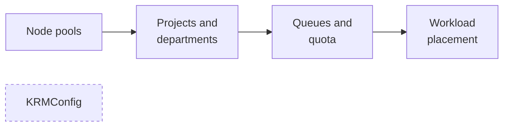

# Concepts

What each KAI Resource Management object means, and how they fit together. Read these
after the [overview](../overview.md); if you would rather do than read, the
[quickstart](../getting-started/quickstart.md) creates all of them in order.

| Concept | Answers |
| --- | --- |
| [Node pools](node-pools.md) | How is the cluster's hardware divided up? |
| [Projects and departments](projects-and-departments.md) | Who are the teams, and what does each one get? |
| [Queues and quota](queues-and-quota.md) | How much may a team use, and what happens when the cluster is busy? |
| [Workload placement](workload-placement.md) | What happens to a pod between `kubectl apply` and running? |
| [KRMConfig](krm-config.md) | How is the installation itself configured? |

## The five custom resources

All of them are cluster-scoped.

| Kind | Short name | Who creates it | Purpose |
| --- | --- | --- | --- |
| `NodePool` | `np` | You | A named slice of the cluster's nodes |
| `Department` | | You | A team hierarchy level holding shared quota |
| `Project` | | You | A team, its quota, and its namespace |
| `ManagedNodesConfig` | | You, optionally | Restricts which nodes KRM manages at all |
| `KRMConfig` | `krmconfig` | The Helm chart, usually | Describes the installation itself |

## Ready-to-apply examples

Every file in [`examples/`](examples/) is complete and self-contained — apply it directly,
no copying out of a page:

```bash
kubectl apply -f docs/concepts/examples/nodepool.yaml
```

| File | Creates |
| --- | --- |
| [`nodepool.yaml`](examples/nodepool.yaml) | A node pool claiming H100 nodes |
| [`department.yaml`](examples/department.yaml) | A department holding shared quota |
| [`project.yaml`](examples/project.yaml) | A project under that department |
| [`workload-pod.yaml`](examples/workload-pod.yaml) | A pod submitted into the project's namespace |
| [`managednodesconfig.yaml`](examples/managednodesconfig.yaml) | A restriction on which nodes are managed |
| [`krmconfig.yaml`](examples/krmconfig.yaml) | An installation description, for self-managed installs only |

Apply them in that order — each states its prerequisites, and the validating webhooks
reject a project whose department or node pool does not yet exist.

## Reading order



Node pools first: projects reference them, and quota is expressed per node pool, so
neither of the next two pages makes sense without them. `KRMConfig` is independent — read
it when you are configuring the installation rather than using it.
