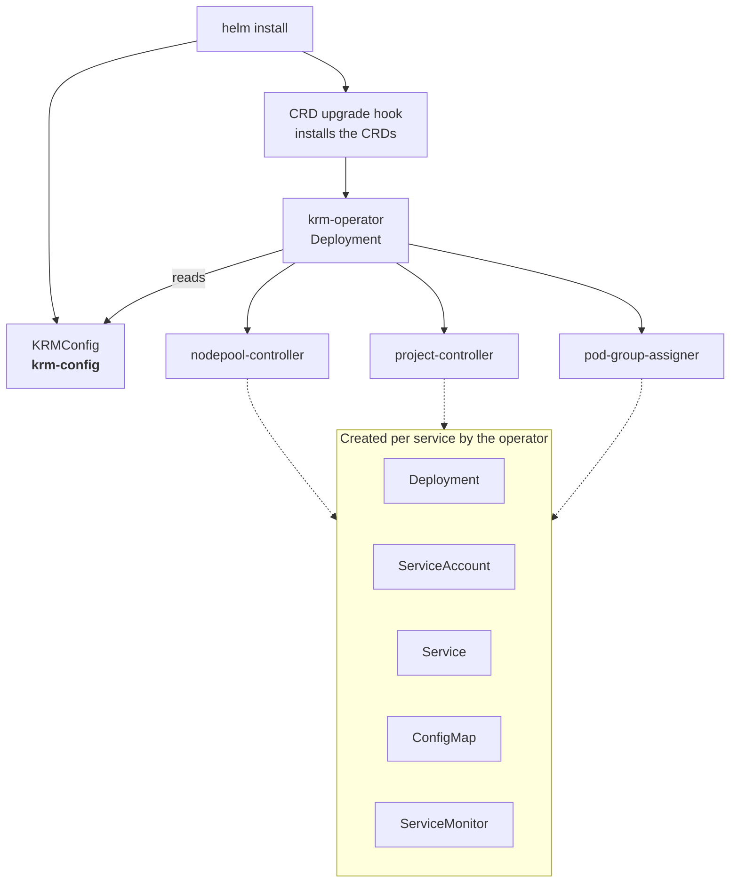

# KRMConfig

`KRMConfig` is the single object that describes a KAI Resource Management installation.
The KRM operator reads it and installs the three services it describes.

Unlike the other custom resources, this one is not something you author as part of using
KRM. In a normal install the Helm chart creates and maintains it from your values, and you
never touch it directly. Read this page when you are configuring or debugging the
installation itself.

## One object, one name

`KRMConfig` is cluster-scoped, and only the singleton named **`krm-config`** is reconciled.
A second one with a different name is ignored rather than merged, so two of them can never
fight over the same objects.

```bash
kubectl get krmconfig
```

```text
NAME         AGE
krm-config   5m
```

## What the operator does with it



For each of the three services the operator creates the Deployment, its ServiceAccount and
Service, any ConfigMap the service reads, and its ServiceMonitors. It also prunes: an
object it created that is no longer wanted is deleted.

**Some things are not the operator's.** The chart, not the operator, renders each service's
RBAC, its admission webhook configurations, and the TLS secrets those webhooks serve with.
That split has a consequence worth knowing: a webhook toggle set directly on the
`KRMConfig`, rather than through chart values, can leave the two disagreeing — a webhook
that is served but never called, or a controller waiting on a certificate that was never
minted. Set webhook toggles through the chart.

## How it gets created

The chart offers three modes. They are documented in full in the
[chart documentation](../../deployments/kai-resource-management-chart/README.md#how-the-krmconfig-is-created);
the summary is:

| Mode | The object is |
| --- | --- |
| **Deployer** (default) | Applied by a post-install hook, deliberately *outside* the Helm release |
| **GitOps** | An ordinary release resource, so ArgoCD tracks and drift-detects it |
| **External** | Not created at all — you create and own it |

The default keeps it outside the release on purpose. Everything the operator creates hangs
its ownership off this object, so if its UID ever changed, all of it would be
cascade-deleted. Applying it server-side converges it forward and never recreates it.

> **Switching modes on a running installation is disruptive in both directions.** Pick one
> at install time and stay on it. The chart documentation explains why.

Never delete and recreate `krm-config` on a running installation, for the same reason.

## Reading its status

This is the first thing to check when an install does not come up.

```bash
kubectl get krmconfig krm-config -o jsonpath='{.status.conditions}' | jq
```

| Condition | `True` means |
| --- | --- |
| `Ready` | Everything below is fine. This is the summary. |
| `Deployed` | Every object the installation needs exists |
| `Available` | Every deployed workload reports itself available |
| `DependenciesFulfilled` | Nothing the installation needs is missing |
| `Reconciling` | A reconcile is in flight right now |

`Ready` alone tells you whether to worry; the others tell you where to look. See
[conditions and phases](../reference/conditions-and-phases.md).

## What it configures

Four blocks under `spec`:

| Block | Covers |
| --- | --- |
| `namespace` | Where the services are deployed. Defaults to the operator's own namespace, i.e. the Helm release namespace |
| `global` | Settings every service inherits: the scheduler vocabulary, replicas, leader election, image pull secrets, scheduling, security context, FIPS mode, monitoring |
| `nodePoolController`, `projectController`, `podGroupAssigner` | Per-service image, resources, replicas, feature toggles, and command-line flags |

An unset field means "no flag is passed", so the service keeps its own built-in default
rather than one this object invented. That is why the stored object shows only what was
actually set.

### The three install-time settings

Three fields under `spec.global` must match the scheduler the services talk to, and
**nothing reconciles them against it**:

| Field | What it is |
| --- | --- |
| `schedulerName` | The scheduler the controllers bind workloads to |
| `queueLabelKey` | The label key carrying a workload's queue |
| `nodePoolLabelKey` | The label key carrying a node's node pool |

Set them at install and leave them alone. Changing one on a running cluster stops
workloads being scheduled until both sides are brought back into line.

Installed from this chart they are filled in from the KAI Scheduler it installs, so the
two agree by construction. You only need to set them yourself when something other than
this chart creates the `KRMConfig`.

### Per-service feature toggles

`projectController.features` decides which per-project resources the controller manages —
whether it creates namespaces, replicates role bindings, and manages a limit range. Each
flag also gates the matching chart RBAC, which is the second reason to set these through
chart values rather than on the object: turning one on here without the chart's matching
grant produces bindings to a role that does not exist.

## Editing it by hand

In deployer mode — the default — the object is applied server-side by the chart's hook, so
whether a hand edit survives is a **per-field** question:

| The field is | On the next `helm upgrade` |
| --- | --- |
| Absent from what the chart renders | The chart never owns it — **your edit survives** |
| Present in what the chart renders | Ownership is taken back — **your edit is overwritten**, silently |
| Present before, dropped since | It is pruned |

To see which fields the chart sets, render its manifest:

```bash
helm template <release> ./deployments/kai-resource-management-chart \
  -s templates/hooks/post/krm-config-deployer/configmap.yaml
```

In GitOps mode none of this applies: the object is a release resource and Helm reverts
every hand edit.

The maintainable answer is to set chart values and upgrade, not to edit the object.

## The self-managed case

If you install with both deployers off, the object is yours to create:

```bash
helm upgrade --install krm ... \
  --set krmConfigDeployer.enabled=false \
  --set krmConfig.render=false

kubectl apply --server-side -f docs/concepts/examples/krmconfig.yaml
```

A commented starting point is in [`examples/krmconfig.yaml`](examples/krmconfig.yaml).

Installing this chart as a subchart of your own is the usual reason to do this — in which
case turn off the bundled KAI Scheduler's own config deployer too. The
[chart documentation](../../deployments/kai-resource-management-chart/README.md#installed-as-a-sub-chart)
covers that.

## Next

- [Chart documentation](../../deployments/kai-resource-management-chart/README.md) —
  install, configure, upgrade, uninstall.
- [API reference](../reference/api.md#krmconfig) — the field surface.
- [Troubleshooting](../how-to/troubleshooting.md) — when the install does not come up.
