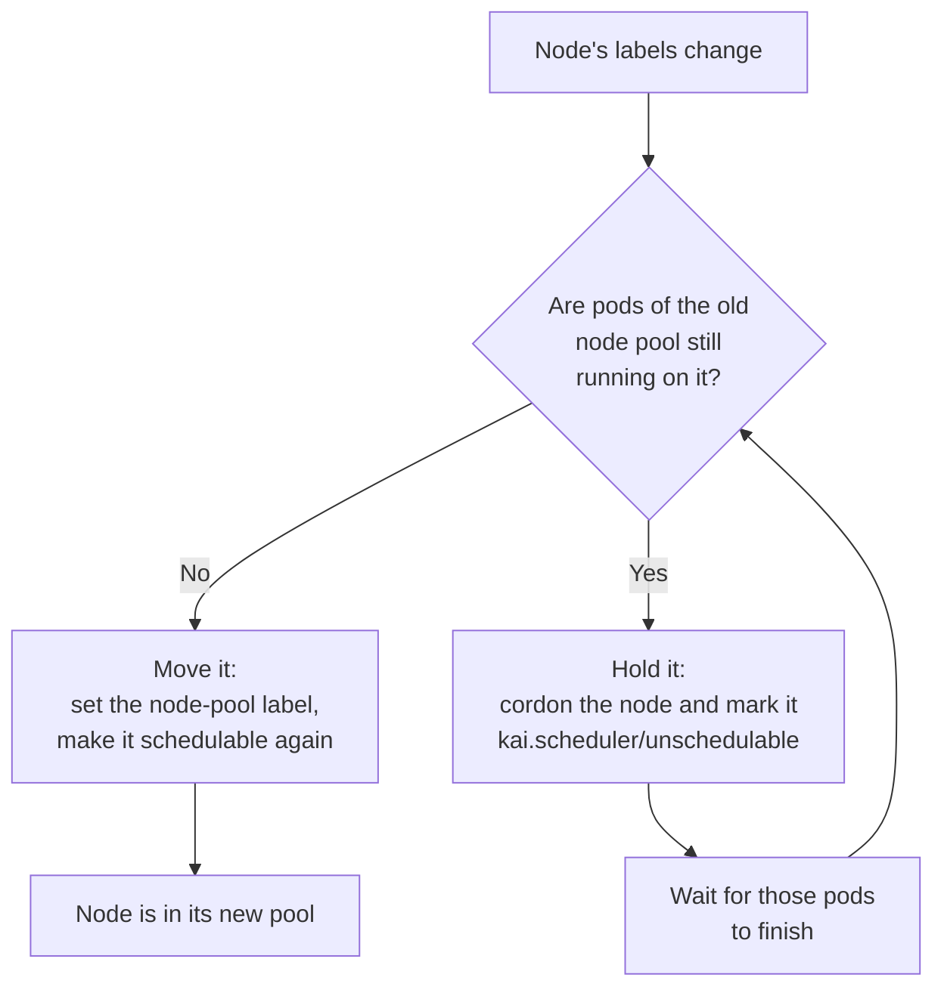

# Node pools

A node pool is a named slice of the cluster's nodes. It exists so that different hardware
can be treated as different capacity: an H100 pool and an A100 pool have separate quota,
separate scheduling behavior, and can be given to different teams.

Node pools are cluster-scoped, and their short name is `np`.

## A node pool selects nodes by one label

A node pool names exactly one label key and one label value. Every node carrying that
key with that value belongs to the pool.

```yaml
apiVersion: kai.resources/v1alpha1
kind: NodePool
metadata:
  name: h100
spec:
  labelKey: nvidia.com/gpu.product
  labelValue: H100
```

Ready to apply: [`examples/nodepool.yaml`](examples/nodepool.yaml).

Two rules are enforced when you create a node pool, and a rejection at `kubectl apply`
time is one of these:

- **The pair must be unique.** No two node pools may share the same key *and* value —
  otherwise a node would belong to two node pools at once.
- **The pair is immutable.** Once created, `labelKey` and `labelValue` cannot be changed,
  and neither can be added or removed. To re-target a node pool, delete it and create a new
  one.

You are labelling the *nodes*, not the node pool. KRM does not put your `labelKey` on nodes for
you — you or your infrastructure do that, and the node pool follows.

### Prefer a label that already exists

In most clusters you do not need to invent a label. Something is already describing your
nodes, and selecting on that is the better habit — a new node joins the right node pool the
moment it registers, with nothing for anyone to remember.

| Label | Set by |
| --- | --- |
| `nvidia.com/gpu.product`, `nvidia.com/gpu.count` | NVIDIA GPU Operator / GPU Feature Discovery |
| `node.kubernetes.io/instance-type`, `topology.kubernetes.io/zone` | Cloud provider |
| `kubernetes.io/arch`, `kubernetes.io/os` | kubelet |
| `feature.node.kubernetes.io/*` | Node Feature Discovery |

Look before you label:

```bash
kubectl get node <node> -o jsonpath='{.metadata.labels}' | jq
```

`labelValue` is matched exactly, so copy the value rather than typing it —
`nvidia.com/gpu.product` is `NVIDIA-H100-80GB-HBM3`, not `H100`.

Add your own label only when nothing existing expresses the split you want — a cluster
with no GPU operator, or a boundary with no hardware meaning, such as reserving nodes for
one team:

```bash
kubectl label node worker-3 example.com/reserved-for=research
```

A node pool whose pair matches no node is not an error: it comes up `Empty` and waits for one.

## The `default` node pool

One node pool is special. The pool named `default` — the name is configurable, but
`default` is what the chart creates — is the **catch-all**: it holds every node that no
other node pool claims.

Because it selects by exclusion rather than by label, it is the only node pool that:

- **must leave `labelKey` and `labelValue` empty**. Setting either is rejected.
- **cannot be deleted.** The deletion webhook refuses. Nothing recreates it, and without
  it every unclaimed node would have no node pool and could not be scheduled onto.

There is a consequence that catches people out: **the default node pool is represented by the
*absence* of the node-pool label, not by the value `default`.** A node in the default node pool
carries no `kai.scheduler/node-pool` label at all. This shows up again in queue selectors
and node affinity — see [queues and quota](queues-and-quota.md).

The chart creates the `default` node pool for you at install time. You can opt out with
`defaultNodePool.enabled=false`, but then you are responsible for every node having a
node pool.

## How a node moves between node pools

Suppose you relabel a node that is currently in the `default` node pool so that it now matches
the `h100` node pool. The node does not move immediately.



The reason for the hold is quota accounting. A pod that was admitted against the `default`
node pool's quota is still consuming it; if the node moved underneath that pod, the pod would be
running on `h100` hardware while charged to a `default` queue. So the node is made
unschedulable, drains naturally as its workloads finish, and then moves.

While that is happening the node pool's status says so, naming the nodes it is waiting on:

```bash
kubectl get nodepool h100 -o jsonpath='{.status.message}'
```

Nothing evicts anything. If the workloads are long-running, the node stays put until they
end. To force the issue, delete the workloads.

## Phases

A node pool's phase summarises whether it can accept work.

| Phase | Meaning |
| --- | --- |
| `Ready` | At least one node in the node pool is ready. Workloads can be placed here. |
| `Empty` | The node pool has no nodes. Still a valid placement target — nodes may appear. |
| `Unschedulable` | The node pool has nodes, but none of them are ready. |
| `MissingPrerequisites` | Nodes are ready, but a scheduling feature you enabled cannot be honoured on them. See [tuning per-node-pool scheduling](../how-to/tune-per-node-pool-scheduling.md). |
| `Deleting` | The node pool is being deleted and something is still holding it. |

Only `Ready` and `Empty` accept workloads. A workload aimed at a node pool in any other phase
is redirected to another of its requested pools if it has one — see
[workload placement](workload-placement.md).

Read the phase, and the message explaining it, with:

```bash
kubectl get nodepool -o custom-columns=NAME:.metadata.name,PHASE:.status.phase
kubectl get nodepool h100 -o jsonpath='{.status.message}'
```

> KRM's custom resources define no printer columns, so a bare
> `kubectl get nodepool` shows only `NAME` and `AGE`, and `-o wide` adds nothing. Ask for
> the fields you want with `-o custom-columns` or `-o jsonpath`, as above.

Per-node detail, including nodes that are ready but failing a prerequisite:

```bash
kubectl get nodepool h100 -o jsonpath='{.status.nodes}' | jq
```

## Each node pool gets its own scheduler

Creating a node pool creates a KAI Scheduler `SchedulingShard` named after it. The shard is
the scheduler instance responsible for that node pool's nodes and queues, which is what makes
per-pool scheduling configuration possible at all: bin-packing on one pool and spreading on
another, different preemption guarantees, different fairness policy.

You do not create or edit the shard. You configure it through the node pool's
`schedulingShardConfig` — see
[tuning per-node-pool scheduling](../how-to/tune-per-node-pool-scheduling.md).

If Prometheus is installed, each node pool also gets a `ServiceMonitor` for its shard.

## Deleting a node pool

Deletion is blocked while anything still depends on the node pool:

- **A project references it.** If any project has a queue for this node pool, deletion
  waits. The node pool reports the `ProjectReferencesExist` condition, naming the projects.
  Remove those queues from the projects — or delete the projects — and it proceeds.
- **Its nodes are still running work.** Its nodes must be reassigned to other node pools
  first, which follows the same drain-before-move rule as above.

While either applies, the node pool sits in `Deleting` with a message saying which. It is not
stuck; it is waiting.

```bash
kubectl get nodepool h100 -o jsonpath='{.status.conditions}' | jq
```

The `default` node pool cannot be deleted at all.

## Restricting which nodes are managed

By default every node in the cluster is eligible for a node pool. To keep some out —
control-plane nodes, nodes owned by another system — create a `ManagedNodesConfig`. Nodes
that do not match its criteria are moved into a reserved excluded node pool that no scheduler
serves.

See [excluding nodes from management](../how-to/exclude-nodes-from-management.md).

## Next

- [Projects and departments](projects-and-departments.md) — who gets to use these node pools.
- [Partitioning nodes into node pools](../how-to/partition-nodes-into-node-pools.md) — a
  worked example on a mixed fleet.
- [API reference](../reference/api.md#nodepool) — every field.
