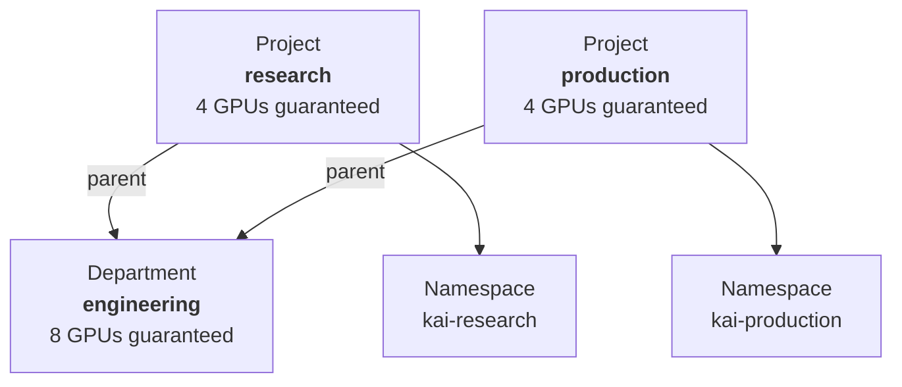
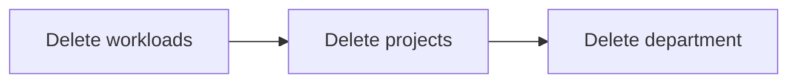

# Projects and departments

A **project** is a team. It is the unit that owns quota, owns a namespace, and that
workloads are submitted into. A **department** is a group of projects that share a larger
pool of quota.

Both are cluster-scoped, and the hierarchy is exactly two levels deep: a project may name
one department as its parent, and a department has no parent of its own.



A department is an accounting construct. Nothing is submitted to a department; it has no
namespace and runs nothing. What it does is cap and share: its projects' guarantees are
carved out of its own, and idle capacity is redistributed within it before it leaves.

The parent is optional. A project with no `parent` is a root in its own right — fine for a
small cluster, and the thing to reach for when you have no organizational layer to model.

## What creating a project gives you

```yaml
apiVersion: kai.resources/v1alpha1
kind: Project
metadata:
  name: research
spec:
  parent: engineering
  enforceKaiScheduler: true
  defaultNodePools:
    - h100
  queues:
    - name: research-h100
      nodepool: h100
      resources:
        gpu:
          deserved: 4
          limit: 8
```

Ready to apply: [`examples/project.yaml`](examples/project.yaml).

Applying that produces:

| What | Detail |
| --- | --- |
| A namespace | Named `kai-research` — the `kai-` prefix is configurable |
| One queue per entry in `queues` | `research-h100`, parented to the department's queue for the same node pool |
| A namespace annotation | Recording `enforceKaiScheduler`, which admission reads back |
| Role bindings | If enabled, replicated into the namespace so the platform's own components can operate in it |
| A limit range | If enabled, giving pods in the namespace default and maximum resources |

Watch it settle and find the namespace it chose:

```bash
kubectl get project research
kubectl get project research -o jsonpath='{.status.namespace}'
```

`status.phase` is `Ready` once every piece exists. If it stays `NotReady`, the conditions
say which piece is missing:

```bash
kubectl get project research -o jsonpath='{.status.conditions}' | jq
```

`NamespaceReady`, `QueuesReady` and `RoleBindingsReady` each report `True`, or `False`
with a reason. See [conditions and phases](../reference/conditions-and-phases.md).

### Using a namespace you already have

By default the namespace is created for you and named `<prefix>-<project>`. To adopt an
existing namespace instead, name it:

```yaml
spec:
  namespace: my-existing-namespace
```

That namespace must already exist — it is labelled and annotated to link it to the
project, not created. A namespace can belong to only one project; pointing a second
project at it is rejected.

## Enforcing the scheduler

`enforceKaiScheduler` decides what happens to a pod created in the project's namespace
that does not ask for the KAI scheduler by name.

| Value | Behaviour |
| --- | --- |
| `true` | Every pod in the namespace is put on the KAI scheduler, whatever it asked for |
| `false` (default) | Only pods that explicitly name the KAI scheduler are managed; everything else goes to the default Kubernetes scheduler and is invisible to KRM |

Turn it on when the namespace is a team's workspace and everything in it should count
against that team's quota. Leave it off when the namespace also holds infrastructure that
must not be scheduled by KAI.

The catch worth knowing: a pod's scheduler name is immutable after creation. A pod
admitted without enforcement cannot be retro-fitted — it runs outside its project's quota
for its whole life. Changing `enforceKaiScheduler` affects new pods only.

## Manually overriding something KRM created

Occasionally you need to hand-manage an object KRM created — a namespace that needs a
label KRM would overwrite, a queue you are tuning by hand. Label it:

```bash
kubectl label namespace kai-research kai.resources/resource-manual-override=true
```

The controller then leaves that object alone entirely: it will not update it, and will not
delete it. The label is respected on namespaces, queues, limit ranges and on the project
itself.

Use it sparingly. An overridden object no longer tracks the spec, so the project's spec
stops being the truth about what exists.

## Deleting

Deletion is ordered, and the order is enforced rather than merely advised.



**A department will not delete while any project still names it as parent.** The
department stays in `Terminating` and reports:

```bash
kubectl get department engineering -o jsonpath='{.status.conditions}' | jq
```

`DepartmentDeletionBlocked` is `True`, with a message naming one of the offending
projects. Delete or re-parent those projects and the department goes.

**A project's own deletion can be made blocking too.** By default a project deletes as
soon as its queues and namespace are cleaned up, whatever is still running inside it. To
require the namespace be empty first, set:

```yaml
spec:
  deletionType: Blocking
```

What counts as "not empty" is configured at install time through the chart's
`projectController.deleteBlockers`, which lists the resource kinds whose presence blocks
deletion. With no blockers configured — the default — nothing blocks a project's deletion,
and `deletionType: Blocking` has no effect.

While blocked, the project reports a condition named after the blocker group, listing what
is still there. Delete those resources and it proceeds.

If a project is genuinely stuck and you accept the consequences, annotate it to force the
deletion through:

```bash
kubectl annotate project research kai/force-delete=true
```

That skips the blockers. Resources left behind in the namespace are yours to clean up.

## Next

- [Queues and quota](queues-and-quota.md) — what those numbers in `queues` actually do.
- [Modelling an org with departments](../how-to/model-an-org-with-departments.md) — a
  worked example.
- [API reference](../reference/api.md#project) — every field.
