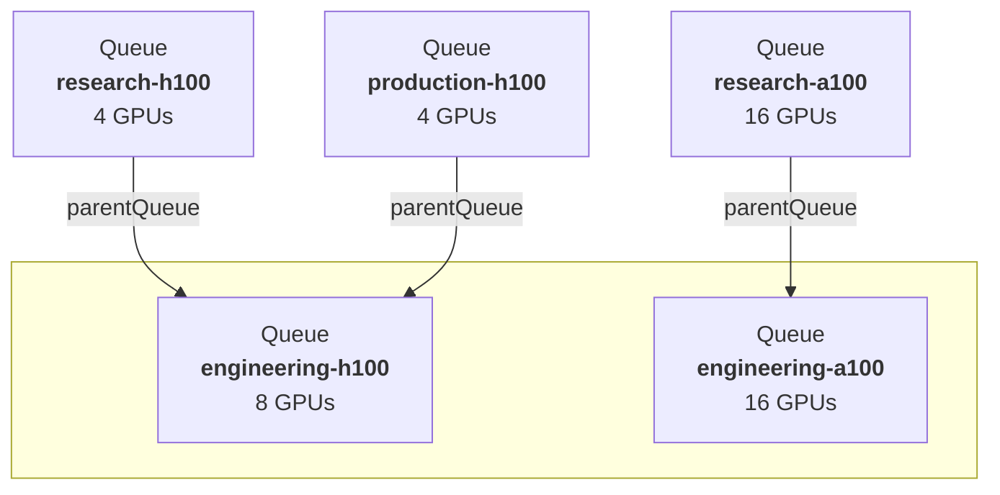

# Queues and quota

A queue is where quota lives. Every workload is charged to exactly one queue, and the
scheduler decides what runs by comparing what each queue is entitled to against what it is
currently using.

You never create a queue directly. You describe queues in a project's or department's
`spec.queues`, and KRM creates and maintains the corresponding KAI Scheduler `Queue`
objects.

## One queue per owner, per node pool

This is the rule that shapes everything else: **a queue is a (owner, node pool) pair**. A
project with entries for two node pools has two queues, with entirely independent quota.
Four GPUs in the `h100` node pool is not four GPUs anywhere — unused `h100` quota does not
become `a100` quota.



A project's queue is parented to its department's queue **for the same node pool**. That
parenting is what makes a department a real limit: `research-h100` and `production-h100`
together cannot exceed what `engineering-h100` allows, however generous their individual
numbers look.

If the department has no queue for a node pool its project uses, the project's queue for
that pool simply has no parent — it becomes a root of its own, unconstrained by the
department. That is usually a mistake in the spec rather than an intent.

## The three numbers

Each of `gpu`, `cpu` and `memory` takes three values, and they answer three different
questions.

| Field | Question it answers |
| --- | --- |
| `deserved` | How much is this team **guaranteed**? It can always reclaim up to this, taking capacity back from teams that borrowed it. |
| `limit` | What is the **hard ceiling**? The team never exceeds this, however idle the cluster is. `-1` means no ceiling. |
| `overQuotaWeight` | When there is spare capacity, **what share of it** does this team get relative to its siblings? |

`deserved` is a guarantee, not a reservation — capacity above what a team is currently
using is lent out, and pulled back when the team asks for it. That is the whole reason to
use queues instead of `ResourceQuota`, which would simply leave the idle capacity unused.

`overQuotaWeight` is relative, not absolute. Two sibling queues weighted `2` and `1` split
spare capacity two-to-one. Weight `0` means the queue never borrows.

### Units

These are easy to get wrong, and getting them wrong is quiet — the queue is created, the
numbers are just not what you meant.

| Resource | Unit | Example |
| --- | --- | --- |
| `gpu` | Whole GPUs, fractions allowed | `0.5` = half a GPU, `8` = eight GPUs |
| `cpu` | **Millicores** | `1000` = 1 core, `32000` = 32 cores |
| `memory` | **Megabytes** (1 MB = 10⁶ bytes) | `128000` = 128 GB |

They are plain numbers, not Kubernetes quantity strings — `"32Gi"` is not valid here.

> **Omitting a value is not the same as leaving it unbounded.** Every one of these fields
> defaults to `0`, and `0` is a real number: a `limit` of `0` is a ceiling of zero, not an
> absent ceiling. Write `-1` for "no ceiling", and set `deserved` explicitly on any queue
> you expect to run something. A queue with `resources` omitted entirely is guaranteed
> nothing, may borrow nothing, and is capped at nothing.

### Priority

`priority` orders queues against each other when the scheduler must choose. It defaults to
`100`; higher wins. Leave it alone unless you have a queue that should consistently beat
its siblings.

## A worked example

```yaml
apiVersion: kai.resources/v1alpha1
kind: Project
metadata:
  name: research
spec:
  parent: engineering
  queues:
    - name: research-h100
      nodepool: h100
      priority: 100
      resources:
        gpu:
          deserved: 4
          limit: 8
          overQuotaWeight: 2
```

Read that as: research is guaranteed 4 H100 GPUs and can never hold more than 8. Between 4
and 8 it is borrowing, and when it competes for spare capacity with a sibling weighted `1`
it gets twice the share. All of it capped by whatever `engineering-h100` allows.

Ready to apply: [`examples/project.yaml`](examples/project.yaml).

## Queue names

You may name a queue yourself, as above. If you leave `name` out, KRM derives one:

| Situation | Derived name |
| --- | --- |
| Queue for a named node pool | `<owner>-<nodepool>`, e.g. `research-h100` |
| Queue for the **default** node pool | `<owner>`, e.g. `research` |
| The derived name is already taken by another project or department | The same, plus a short random suffix |

Names are capped at 63 characters, so a long project name is truncated before the suffix is
added. Because of the collision suffix, the queue's actual name is not always predictable
from the spec — read it back rather than assuming:

```bash
kubectl get queue -l project=research
```

## The default node pool has no label

Queues carry a `kai.scheduler/node-pool` label naming their node pool — **except** queues
for the default node pool, which carry no such label at all. The default pool is
represented by absence throughout the system.

This matters the moment you write a selector by hand. To find queues for the default node
pool you must select on the label *not existing*:

```bash
# Queues for the h100 pool
kubectl get queue -l kai.scheduler/node-pool=h100

# Queues for the default pool
kubectl get queue -l '!kai.scheduler/node-pool'
```

The same asymmetry appears in pod node affinity — see
[workload placement](workload-placement.md).

### Give the default node pool a queue

You are not required to, but you should. The default node pool always exists and always
holds whatever nodes no other pool claimed, and it is the final fallback when a workload's
requested pools are all unavailable. A project with no queue for it has nowhere to charge
work that lands there.

The convention is to name that queue after its owner, which is also what KRM would derive:

```yaml
queues:
  - name: research          # the project's own name
    nodepool: default
  - name: research-h100
    nodepool: h100
```

Both [`examples/department.yaml`](examples/department.yaml) and
[`examples/project.yaml`](examples/project.yaml) do this.

## Reading consumption back

A project's status reports what its queues are actually using, per node pool and in total:

```bash
# Per node pool
kubectl get project research -o jsonpath='{.status.nodePoolsQuotaStatuses}' | jq

# Summed across all node pools
kubectl get project research -o jsonpath='{.status.quotaStatus}' | jq
```

Three figures are reported:

| Figure | Meaning |
| --- | --- |
| `requested` | What running **and pending** workloads have asked for |
| `allocated` | What running workloads actually hold |
| `allocatedNonPreemptible` | The part of `allocated` that cannot be reclaimed by another queue |

`requested` well above `allocated` means work is queued and waiting — either the quota or
the cluster is the constraint. `allocatedNonPreemptible` approaching `deserved` means
there is little the scheduler can take back if a sibling reclaims.

## What happens when you change a queue

Editing `spec.queues` on a project updates the corresponding `Queue` objects in place.
Removing an entry deletes its queue — including any workloads' claim on that quota, so
workloads charged to it stop being schedulable. Adding a node pool to `defaultNodePools`
without adding a queue for it is rejected at admission.

A queue you have marked with the manual-override label is left alone. See [projects and
departments](projects-and-departments.md#manually-overriding-something-krm-created).

## Next

- [Workload placement](workload-placement.md) — how a pod ends up charged to one of these.
- [Modelling an org with departments](../how-to/model-an-org-with-departments.md).
- [API reference](../reference/api.md#queueconfig) — every field.
