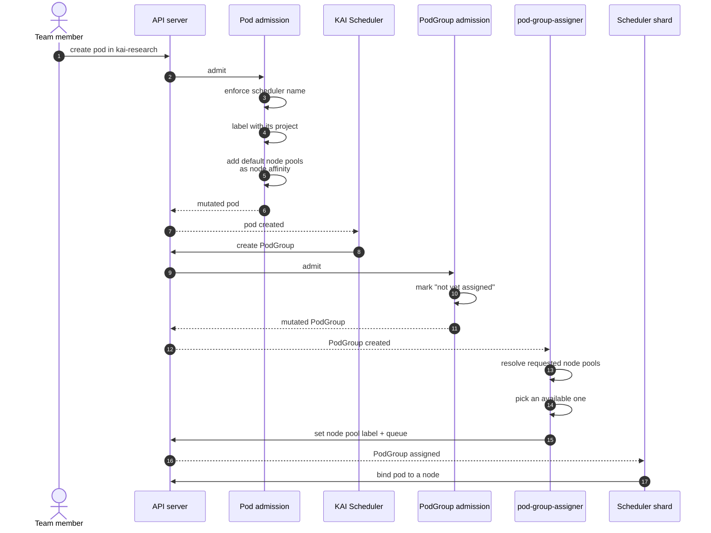
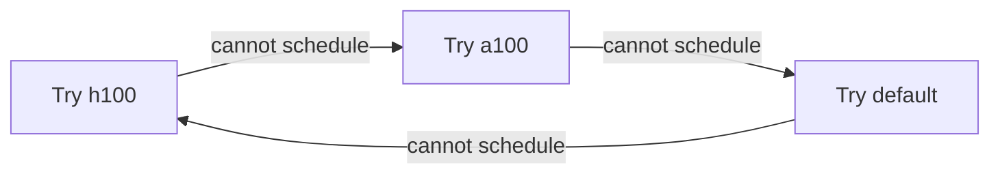

# Workload placement

A team member submits an ordinary pod. They name no queue and no node pool, and in a
project that enforces the scheduler they need not name that either. By the time it runs it
has all three. This page is what happens in between.

## The path a pod takes



Two admission webhooks and one controller. Everything they write is visible on the objects
afterwards, which is what makes this debuggable — see
[troubleshooting](../how-to/troubleshooting.md).

## Step 1: admission mutates the pod

When a pod is created in a project's namespace, three things happen to it.

**The scheduler name is enforced.** If the project has `enforceKaiScheduler: true`, the
pod is put on the KAI scheduler whatever it asked for. If not, only pods that already
named the KAI scheduler are touched; everything else passes through untouched and is
invisible to KRM for the rest of its life.

**The pod is labelled with its project.** A `project` label is added, resolved from the
namespace. A pod that already carries the label keeps its own value — a workload builder
that set one knows better than the namespace default.

**The project's default node pools are added as node affinity.** If the project has
`defaultNodePools`, they become required node affinity, so the pod can only land on those
pools' nodes. This step is skipped if the pod already expresses a node pool preference of
its own, by label or by affinity.

Check what happened:

```bash
kubectl get pod sample-workload -n kai-research \
  -o jsonpath='{.spec.schedulerName}{"\n"}{.metadata.labels.project}{"\n"}'
```

This step is fail-open by design. If the project cannot be resolved — an unlabelled
namespace, a missing project — the pod is admitted unmutated rather than rejected. A
misconfiguration should not stop people creating pods. The exception is the scheduler-name
decision itself, which is fail-closed: the pod is rejected rather than admitted onto the
wrong scheduler, because that choice is immutable and cannot be corrected afterwards.

## Step 2: KAI Scheduler creates a PodGroup

KAI Scheduler groups related pods into a `PodGroup` — one pod for a simple workload, all
of them for a distributed job that must be gang-scheduled. The PodGroup, not the pod, is
the unit that gets a node pool and a queue.

On creation, admission marks the PodGroup as **not yet assigned** to any node pool, using
a sentinel value rather than leaving the label off. That distinguishes "no node pool has
been chosen yet" from "this belongs to the default node pool", which is itself expressed
by the label's absence.

## Step 3: the assigner picks a node pool

`pod-group-assigner` works out which node pools the workload asked for, in this order. The
first source that yields anything wins:

| # | Source | Set by |
| --- | --- | --- |
| 1 | The `kai.scheduler/node-pools` annotation on the pod — a space-separated list | The workload author, explicitly |
| 2 | The pod's required node affinity, matched against every node pool's label pair | The author, or step 1 of admission |
| 3 | A node pool label on the PodGroup itself | Tooling that assigns directly |
| 4 | The project's `defaultNodePools`, in order | The project spec |
| 5 | The `default` node pool | Nothing — this is the fallback |

The result is an ordered list of candidates, not a single choice. The assigner walks it
and takes the first pool whose phase is `Ready` or `Empty`; a pool that is
`Unschedulable`, `Deleting` or `MissingPrerequisites` is skipped.

It then writes onto the PodGroup:

- the node pool label naming the chosen pool — or removes it, if the choice was `default`;
- `spec.queue`, resolved to the project's queue for that pool.

```bash
kubectl get podgroup -n kai-research \
  -o custom-columns=NAME:.metadata.name,QUEUE:.spec.queue,POOL:'.metadata.labels.kai\.scheduler/node-pool'
```

If none of the candidate pools is available, the assigner reports an error and retries.
The workload waits rather than being placed somewhere it was not asked to go.

## Step 4: the shard schedules it

Each node pool has its own scheduler shard. The shard for the chosen pool sees the
PodGroup, checks it against its queue's quota and the pool's nodes, and binds the pods.

From here it is ordinary KAI Scheduler behaviour: gang scheduling, preemption,
reclamation between queues, whatever the pool's
[scheduling configuration](../how-to/tune-per-node-pool-scheduling.md) says.

## When the first choice does not fit

A workload with more than one candidate node pool is not stuck with its first pick. If the
shard cannot schedule it there, it records that on the PodGroup, and the assigner moves it
to the next pool in the list — round-robin, wrapping around.



Two details govern how long this goes on:

- **With one candidate pool**, there is nowhere to move to. The workload waits in that
  pool indefinitely until capacity appears.
- **With several**, the workload cycles. On reaching the last pool in the list it is
  marked unschedulable, which is what surfaces the failure to the user rather than
  spinning silently. If a pool it already tried becomes available again, the cycle
  continues.

A workload whose pods are all already running is never reassigned, even if its node pool
later becomes unschedulable. Reassignment is for work that has not started.

## Network topology

If a workload's chosen node pool names a preferred network topology, the assigner adds a
*preferred* topology constraint to the PodGroup at that topology's lowest level, so pods
are packed close together on the network where possible.

The rule that protects you: **a constraint you set yourself is never overridden.** The
assigner marks the constraints it adds, and only ever refreshes or removes its own. If you
set a topology constraint on a PodGroup by hand, it stands.

## Overriding placement as a workload author

You do not have to accept the project's defaults. In increasing order of precedence:

```yaml
# Node affinity — the portable way, also works for non-KRM clusters
spec:
  affinity:
    nodeAffinity:
      requiredDuringSchedulingIgnoredDuringExecution:
        nodeSelectorTerms:
          - matchExpressions:
              - key: nvidia.com/gpu.product
                operator: In
                values: ["H100"]
```

```yaml
# The annotation — names node pools directly, in preference order
metadata:
  annotations:
    kai.scheduler/node-pools: "h100 a100"
```

To target the **default** node pool by affinity, remember it is an absence:

```yaml
- key: kai.scheduler/node-pool
  operator: DoesNotExist
```

More in
[placing workloads across node pools](../how-to/place-workloads-across-node-pools.md).

## Next

- [Placing workloads across node pools](../how-to/place-workloads-across-node-pools.md) —
  worked examples of each override.
- [Troubleshooting](../how-to/troubleshooting.md) — when a pod does not reach the
  scheduler, or a PodGroup never gets a queue.
- [Labels and annotations](../reference/labels-and-annotations.md) — every key mentioned
  here.
