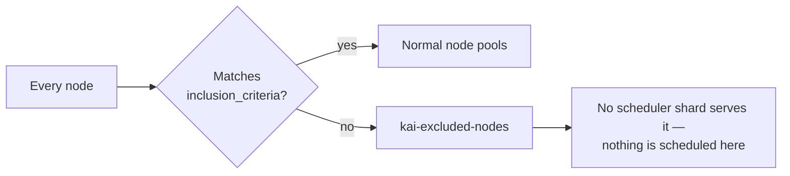

# Exclude nodes from management

**Goal:** keep some nodes outside KAI Resource Management entirely — infrastructure nodes,
nodes owned by another system, nodes being retired — so no node pool claims them and
nothing is scheduled onto them by KAI Scheduler.

**You need:** KRM installed.

## When you need this

By default **every node in the cluster is eligible for a node pool**, and any node no pool
claims falls into `default`. That is usually right. Reach for a `ManagedNodesConfig` when
it is not:

- Control-plane or infrastructure nodes that should never run user workloads.
- Nodes belonging to another scheduler or platform sharing the cluster.
- Nodes being drained for retirement, which you want out of quota accounting now.

If instead you want the nodes managed but held separately — dedicated to one team, say —
you want a [node pool](partition-nodes-into-node-pools.md), not exclusion.

## How it works



Nodes that do not match are moved into a **reserved excluded node pool**, by default named
`kai-excluded-nodes`. No scheduler shard serves it, so the nodes are still in the cluster
and still run whatever else you put on them — they are simply invisible to KAI.

This is a **whitelist**: you describe the nodes to keep, not the nodes to drop.

## 1. Create the config

The name is fixed. Only the singleton named `kai-managed-nodes-config` is reconciled; any
other name is silently ignored.

```yaml
apiVersion: kai.resources/v1alpha1
kind: ManagedNodesConfig
metadata:
  name: kai-managed-nodes-config
spec:
  inclusion_criteria:
    nodeSelectorTerms:
      - matchExpressions:
          - key: node-role.kubernetes.io/control-plane
            operator: DoesNotExist
```

Full file: [`examples/managednodesconfig.yaml`](../concepts/examples/managednodesconfig.yaml).

Note the field name: **`inclusion_criteria`**, with an underscore, not camelCase like the
rest of the API.

Its value is a core Kubernetes `NodeSelector`: terms are OR-ed, expressions within a term
are AND-ed. So to keep only GPU nodes in two named zones:

```yaml
spec:
  inclusion_criteria:
    nodeSelectorTerms:
      - matchExpressions:
          - key: nvidia.com/gpu.count
            operator: Exists
          - key: topology.kubernetes.io/zone
            operator: In
            values: ["us-east-1a", "us-east-1b"]
```

> **Get the criteria right before you apply.** This is a whitelist, so an over-narrow
> selector excludes far more than you meant — in the limit, the whole cluster. Check what
> it would match first:
>
> ```bash
> kubectl get nodes -l '!node-role.kubernetes.io/control-plane'
> ```

## 2. Apply it and watch it settle

```bash
kubectl apply -f docs/concepts/examples/managednodesconfig.yaml

kubectl get managednodesconfig kai-managed-nodes-config \
  -o jsonpath='{.status.conditions}' | jq
```

`Applied` is `True` with reason `AllNodesIncludedCorrectly` once every node is where it
belongs.

## Exclusion is graceful

A node still running workloads of its current node pool is **not** yanked out. It is:

1. labelled `kai.scheduler/to-exclude=true`,
2. made unschedulable, so nothing new lands on it,
3. left to drain naturally.

Only once no workload of its old pool remains does it move to the excluded pool. Until
then the config reports the wait:

```json
[{"type":"Applied","status":"False","reason":"ToBeExcludedNodes",
  "message":"Some nodes need to be drained before gracefull exclusion: worker-3"}]
```

`Applied: False` here means "in progress", not "failed". Nothing is evicted. If the
workloads are long-running and you want the node out now, delete them.

Find the nodes mid-exclusion:

```bash
kubectl get nodes -l kai.scheduler/to-exclude=true
```

## Reversing it

Widen `inclusion_criteria` so the node matches again, or relabel the node. It is moved
back into the `default` pool and the drain marker is removed.

Deleting the `ManagedNodesConfig` entirely returns every node to eligibility.

Reversal is not graceful in the same way — nothing was scheduled on an excluded node by
KAI, so there is nothing to drain.

## Checking which nodes are excluded

```bash
kubectl get nodes -L kai.scheduler/node-pool
```

```text
NAME       STATUS   ROLES           AGE   VERSION   NODE-POOL
master-1   Ready    control-plane   5d    v1.34.0   kai-excluded-nodes
worker-1   Ready    <none>          5d    v1.34.0   h100
worker-2   Ready    <none>          5d    v1.34.0
```

`worker-2` shows an empty node pool because it is in the **`default`** pool, which is
represented by the label's absence — not because it is unmanaged. Excluded nodes carry the
excluded pool's name explicitly.

## Common mistakes

| Symptom | Cause |
| --- | --- |
| Nothing happens at all | The object is not named `kai-managed-nodes-config` |
| Far more nodes excluded than expected | The criteria are a whitelist. Everything not matching is excluded |
| `Applied: False`, reason `ToBeExcludedNodes` | Working as intended — nodes are draining |
| A node never leaves | Workloads of its current pool are still running on it |
| Excluded nodes still run pods | Expected. Exclusion only stops KAI scheduling onto them; other schedulers are unaffected |

## See also

- [Node pools](../concepts/node-pools.md) — where the eligible nodes go.
- [Partition nodes into node pools](partition-nodes-into-node-pools.md) — for separating
  nodes rather than removing them.
