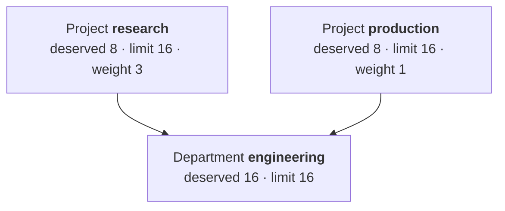

# Model an org with departments

**Goal:** give several teams a shared budget, so each has a guarantee it can always
reclaim, can borrow the others' idle capacity, and cannot collectively exceed what the
organization bought.

**You need:** KRM installed and at least one node pool.

## The shape



Read that as: each team is guaranteed 8 GPUs and can always get them back. Either may grow
to 16 when the other is idle, but never past the department's 16 — so the two together can
never exceed what engineering owns. When both want spare capacity at once, research gets
three quarters of it.

## 1. Create the department

The department holds the ceiling. It runs nothing itself — no namespace, no workloads.

```yaml
apiVersion: kai.resources/v1alpha1
kind: Department
metadata:
  name: engineering
spec:
  queues:
    - name: engineering
      nodepool: default
      resources:
        gpu: { deserved: 0, limit: 0, overQuotaWeight: 0 }
        cpu: { deserved: 8000, limit: -1, overQuotaWeight: 1 }
        memory: { deserved: 32000, limit: -1, overQuotaWeight: 1 }
    - name: engineering-h100
      nodepool: h100
      resources:
        gpu: { deserved: 16, limit: 16, overQuotaWeight: 1 }
        cpu: { deserved: 64000, limit: 64000, overQuotaWeight: 1 }
        memory: { deserved: 256000, limit: 256000, overQuotaWeight: 1 }
```

Setting `limit` equal to `deserved` makes the department a hard ceiling: its projects can
rearrange 16 GPUs between themselves but the department never grows past 16. Set `limit`
higher if the department should itself be able to borrow from a sibling department.

Full file: [`examples/department.yaml`](../concepts/examples/department.yaml).

## 2. Create the projects under it

```yaml
apiVersion: kai.resources/v1alpha1
kind: Project
metadata:
  name: research
spec:
  parent: engineering
  enforceKaiScheduler: true
  defaultNodePools: [h100]
  queues:
    - name: research
      nodepool: default
      resources:
        gpu: { deserved: 0, limit: 0, overQuotaWeight: 0 }
        cpu: { deserved: 4000, limit: -1, overQuotaWeight: 1 }
        memory: { deserved: 16000, limit: -1, overQuotaWeight: 1 }
    - name: research-h100
      nodepool: h100
      resources:
        gpu: { deserved: 8, limit: 16, overQuotaWeight: 3 }
---
apiVersion: kai.resources/v1alpha1
kind: Project
metadata:
  name: production
spec:
  parent: engineering
  enforceKaiScheduler: true
  defaultNodePools: [h100]
  queues:
    - name: production
      nodepool: default
      resources:
        gpu: { deserved: 0, limit: 0, overQuotaWeight: 0 }
        cpu: { deserved: 4000, limit: -1, overQuotaWeight: 1 }
        memory: { deserved: 16000, limit: -1, overQuotaWeight: 1 }
    - name: production-h100
      nodepool: h100
      resources:
        gpu: { deserved: 8, limit: 16, overQuotaWeight: 1 }
```

Three things make this work as intended, and each is easy to get wrong:

- **`parent` must name an existing department.** The webhook rejects the project
  otherwise.
- **The project's queues must be for the same node pools as the department's.** Parenting
  is per node pool. A project queue for a pool the department has no queue for becomes a
  root of its own, silently unconstrained by the department.
- **The children's `deserved` should sum to the department's.** Nothing enforces this. If
  they sum to more, the guarantees are not all honourable at once and the scheduler
  arbitrates by weight and priority; if less, some of the department's capacity is
  guaranteed to nobody.

## 3. Check the hierarchy formed

```bash
kubectl get queue -o custom-columns=\
NAME:.metadata.name,PARENT:.spec.parentQueue,DESERVED:.spec.resources.gpu.quota,LIMIT:.spec.resources.gpu.limit
```

```text
NAME               PARENT             DESERVED   LIMIT
engineering        <none>             0          0
engineering-h100   <none>             16         16
production         engineering        0          0
production-h100    engineering-h100   8          16
research           engineering        0          0
research-h100      engineering-h100   8          16
```

A `PARENT` of `<none>` on a project's queue means the parenting did not happen — check
that the department has a queue for that same node pool.

## Choosing the numbers

| You want | Set |
| --- | --- |
| A guarantee the team can always reclaim | `deserved` |
| A ceiling it can never pass | `limit` |
| No ceiling at all | `limit: -1` |
| A larger share of spare capacity than a sibling | A higher `overQuotaWeight` |
| A team that never borrows | `overQuotaWeight: 0` |
| A team whose work is never preempted for a sibling | Raise `priority` above the siblings' (default `100`) |

`deserved` is a guarantee, not a reservation: capacity a team is not using is lent out and
pulled back when it asks. That is the entire reason to use this rather than
`ResourceQuota`.

Remember every field defaults to `0`, and `0` is a real ceiling. See
[queues and quota](../concepts/queues-and-quota.md).

## Ordered deletion

The hierarchy is enforced on the way out too.

```bash
kubectl delete department engineering
```

That hangs — deliberately — while any project still names it:

```bash
kubectl get department engineering -o jsonpath='{.status.conditions}' | jq
```

```json
[{"type":"DepartmentDeletionBlocked","status":"True","reason":"ProjectsStillAssigned",
  "message":"2 project(s) still reference this department, e.g. \"research\""}]
```

Delete or re-parent the projects and it completes on its own.

To require that a project's own namespace be emptied before it can go, set:

```yaml
spec:
  deletionType: Blocking
```

What counts as "not empty" is configured at install time through the chart's
`projectController.deleteBlockers`. With none configured — the default —
`deletionType: Blocking` has no effect, because nothing is registered as a blocker.

## Reading consumption back

```bash
kubectl get project research -o jsonpath='{.status.nodePoolsQuotaStatuses}' | jq
```

`requested` well above `allocated` means the team is asking for more than it is getting —
either its own `limit` or the cluster is the constraint. Compare across sibling projects to
see which one is holding the department's capacity.

## When you do not need a department

A project's `parent` is optional. If you have one team, or several teams with genuinely
separate budgets that never share, skip departments entirely — each project is then a root
in its own right, and its `limit` is the only ceiling. You can add a department later; it
means editing each project's `parent` and adding the matching department queues.

## See also

- [Queues and quota](../concepts/queues-and-quota.md) — what the numbers do.
- [Projects and departments](../concepts/projects-and-departments.md) — the concept in full.
- [Partition nodes into node pools](partition-nodes-into-node-pools.md) — the other axis
  of the split.
