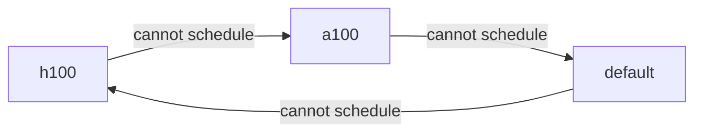

# Place workloads across node pools

**Goal:** control which node pool a workload runs on — and give it somewhere to fall back
to when that pool is full.

**You need:** KRM installed, a project, and more than one node pool to choose between.

## The resolution order

Every workload ends up with an **ordered list of candidate node pools**. The first source
below that produces anything wins outright; the rest are not consulted.

| # | Source | Where it is set | Use it for |
| --- | --- | --- | --- |
| 1 | `kai.scheduler/node-pools` annotation | On the pod | One workload that needs a specific node pool, or a specific fallback order |
| 2 | Required node affinity | On the pod | Expressing hardware requirements portably |
| 3 | Node pool label | On the PodGroup | Tooling that assigns directly |
| 4 | `defaultNodePools` | On the project | The normal case — every workload in the project |
| 5 | The `default` node pool | Nothing | The final fallback |

The pod group assigner walks the resulting list and takes the first node pool whose phase
is `Ready` or `Empty`. Node pools that are `Unschedulable`, `Deleting` or
`MissingPrerequisites` are skipped.

## Set the project default

Most workloads should need no annotation at all. Put the answer on the project:

```yaml
apiVersion: kai.resources/v1alpha1
kind: Project
metadata:
  name: research
spec:
  parent: engineering
  defaultNodePools:
    - h100
    - a100
  queues:
    - name: research-h100
      nodepool: h100
      resources:
        gpu: { deserved: 4, limit: 8, overQuotaWeight: 1 }
    - name: research-a100
      nodepool: a100
      resources:
        gpu: { deserved: 8, limit: 16, overQuotaWeight: 1 }
```

**Order is preference.** Work goes to `h100` when it can, and falls back to `a100` when it
cannot.

**Every node pool listed must have a queue in the same spec.** The webhook enforces this,
and the reason is that a pool with no queue is a pool the work cannot be charged to:

```text
the nodepool "a100" from the DefaultNodePools list has no queue defined in the spec
```

Admission also turns `defaultNodePools` into required node affinity on each pod, so the
pods physically cannot land outside those node pools.

## Override for one workload

### By annotation — names node pools directly

```yaml
apiVersion: v1
kind: Pod
metadata:
  name: needs-h100
  namespace: kai-research
  annotations:
    kai.scheduler/node-pools: "h100 a100"
spec:
  schedulerName: kai-scheduler
  containers:
    - name: workload
      image: registry.k8s.io/pause:3.9
```

Space-separated, in preference order. This is the highest-precedence source, so it
overrides the project's defaults entirely.

Use it when the workload author knows something the project default cannot express — a job
that must have H100s, or one that should prefer the cheaper node pool.

### By node affinity — portable

```yaml
spec:
  schedulerName: kai-scheduler
  affinity:
    nodeAffinity:
      requiredDuringSchedulingIgnoredDuringExecution:
        nodeSelectorTerms:
          - matchExpressions:
              - key: nvidia.com/gpu.product
                operator: In
                values: ["NVIDIA-H100-80GB-HBM3"]
```

The assigner matches these expressions against each node pool's label pair and derives the
candidate list from that. This is the better choice when the manifest also has to work on
a cluster without KRM: it is ordinary Kubernetes affinity, and it means the same thing
either way.

Constraints:

- **Only the `In` operator is matched to node pools**, plus the special case below.
  `NotIn`, `Exists` and `Gt`/`Lt` are still honoured by Kubernetes as ordinary affinity;
  they just do not select a node pool.
- Only **required** affinity is considered. `preferredDuringScheduling...` does not select
  a node pool.
- Several node pools named in one term collapse to the set of pools matched; each term is
  an alternative.

Because setting a pod's own node affinity counts as expressing a preference, admission
leaves it alone rather than adding the project's defaults on top.

### Targeting the default node pool

The `default` node pool is represented by the **absence** of the node-pool label, so it is
selected with `DoesNotExist`, not by naming it:

```yaml
- key: kai.scheduler/node-pool
  operator: DoesNotExist
```

By annotation it is simply named:

```yaml
kai.scheduler/node-pools: "default"
```

## The fallback, when the first node pool cannot take it

A workload with more than one candidate node pool is not stuck with its first pick. If the
scheduler for that pool cannot place it, the assigner moves it to the next pool in the
list, wrapping around.



Two behaviours follow from the list's length, and they are quite different:

- **One candidate node pool.** There is nowhere to go. The workload waits in that pool
  indefinitely until capacity frees up. It is not marked unschedulable, because there is
  nothing to report — it is simply queued.
- **Several.** The workload cycles. On reaching the last node pool in the list it is marked
  unschedulable, which is what surfaces the failure rather than letting it spin silently.
  If a node pool it already tried frees up, cycling continues.

A workload whose pods are **all already running** is never moved, even if its node pool
later goes unschedulable. Reassignment applies to work that has not started.

Watch it move:

```bash
kubectl get podgroup -n kai-research -w -o custom-columns=\
NAME:.metadata.name,POOL:'.metadata.labels.kai\.scheduler/node-pool',QUEUE:.spec.queue
```

## Verify what a workload actually got

```bash
# What admission put on the pod
kubectl get pod needs-h100 -n kai-research -o jsonpath='{.spec.affinity.nodeAffinity}' | jq

# Which pool and queue the assigner chose
kubectl get podgroup -n kai-research -o custom-columns=\
NAME:.metadata.name,POOL:'.metadata.labels.kai\.scheduler/node-pool',QUEUE:.spec.queue

# Where it ended up
kubectl get pod needs-h100 -n kai-research -o wide
```

## Common mistakes

| Symptom | Cause |
| --- | --- |
| Workload ignores `defaultNodePools` | The pod sets its own affinity or annotation, which takes precedence |
| Project rejected on create | A node pool in `defaultNodePools` has no queue in the same spec |
| Everything lands in `default` | The project has no `defaultNodePools`, and the pod expressed no preference |
| Affinity is set but no node pool is selected | The operator is not `In`, the affinity is `preferred` rather than `required`, or the value does not exactly match a node pool's `labelValue` |
| PodGroup never gets a queue | The project has no queue for the node pool that was chosen |
| Workload never falls back | It has only one candidate node pool |

## See also

- [Workload placement](../concepts/workload-placement.md) — the full path a pod takes.
- [Queues and quota](../concepts/queues-and-quota.md) — what it is charged to once placed.
- [Troubleshooting](troubleshooting.md) — when a pod does not reach the scheduler at all.
