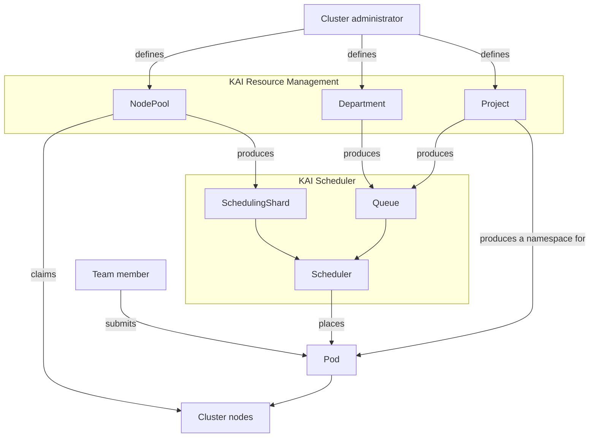
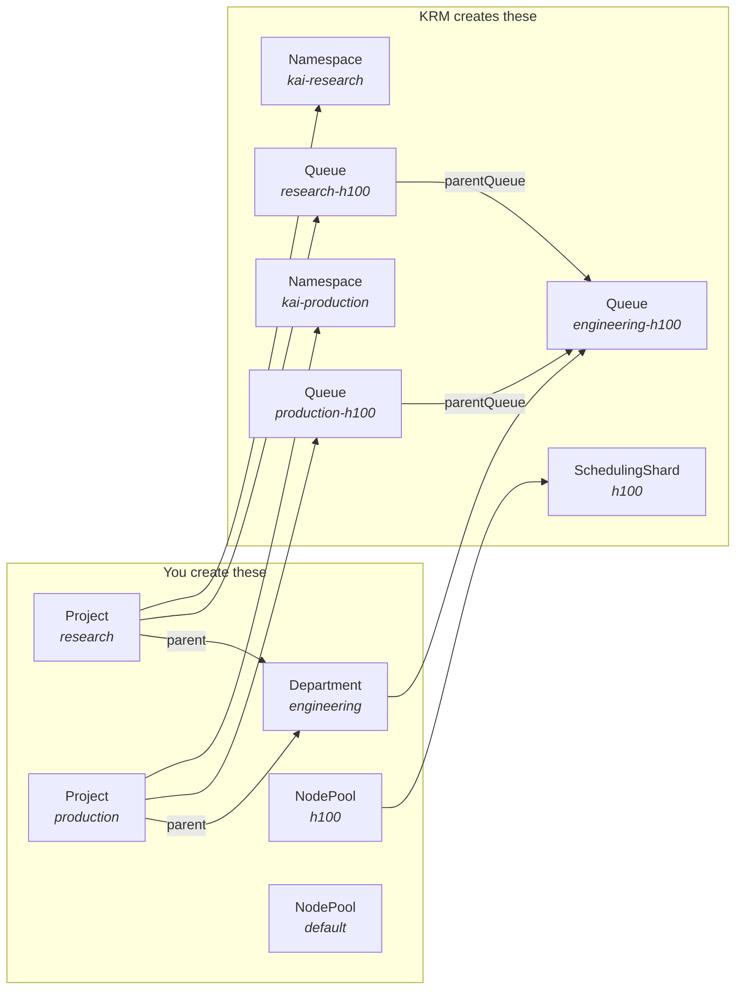

# Overview

KAI Resource Management (KRM) is a Kubernetes-native resource management layer for
[KAI Scheduler](https://github.com/kai-scheduler/KAI-Scheduler). KAI Scheduler decides
which pod runs on which node and when. KRM decides everything around that: which teams
exist, how much of the cluster each may use, which nodes belong to which slice of the
cluster, and where a submitted workload should be placed.

## The problem it solves

A shared GPU cluster has more demand than capacity, and more than one team asking for it.
Plain Kubernetes gives you namespaces and `ResourceQuota`, which is a hard cap: unused
quota is wasted, and there is no way to say "this team gets 8 GPUs, but may borrow more
when the cluster is idle". It also gives you no way to express that the A100 nodes and
the H100 nodes are different pools of capacity with different scheduling behavior.

KRM adds five things:

- **Node pools** — named slices of the cluster's nodes, each with its own scheduler
  configuration.
- **Departments and projects** — a two-level team hierarchy, cluster-scoped.
- **Queues** — per-project, per-node-pool quota with a guaranteed share, a hard ceiling,
  and a weight that governs how idle capacity is shared out.
- **Project namespaces** — created and maintained for you, so a team gets a place to
  submit work.
- **Automatic placement** — a submitted workload is put on the right node pool and
  charged to the right queue, without the user naming either.

## Where KRM sits



You author `NodePool`, `Department` and `Project` objects. KRM turns them into the
`Queue` and `SchedulingShard` objects KAI Scheduler consumes, labels the nodes, creates
the namespaces, and stamps each submitted workload with the node pool and queue it
belongs to. KAI Scheduler does the actual scheduling.

The KAI Scheduler chart is bundled with the KRM chart, so installing KRM installs both.

## What gets installed

Four services. Only the first is installed by Helm; it installs the rest.

| Service | What it does for you |
| --- | --- |
| `krm-operator` | Reads a single `KRMConfig` object and installs and maintains the other three services |
| `nodepool-controller` | Keeps every node assigned to the right node pool, and gives each pool its own scheduler shard |
| `project-controller` | Gives each project a namespace and its quota queues, and controls the order things can be deleted in |
| `pod-group-assigner` | Places each submitted workload on a node pool and charges it to its project's queue |

## The object model

Everything except namespaces and workloads is cluster-scoped.



Three relationships are worth fixing in your head, because everything else follows from
them:

1. **A project belongs to at most one department.** The department's quota is the ceiling
   its projects share.
2. **There is one queue per (owner, node pool) pair.** A project with queues in two node
   pools has two queues, with independent quota. Each is parented to its department's
   queue *for the same node pool*.
3. **A node belongs to exactly one node pool.** Which one is decided by the node's
   labels, not by anything you write on the node pool's status.

## What a user does day to day

An administrator creates node pools, departments and projects. A team member does not
touch any of those — they submit an ordinary pod into their project's namespace:

```bash
kubectl apply -n kai-research -f my-job.yaml
```

Admission mutates the pod onto the KAI scheduler, labels it with its project, and
restricts it to the project's default node pools. KAI Scheduler groups the pod into a
`PodGroup`; `pod-group-assigner` picks the node pool and writes the queue name onto it;
the scheduler shard for that pool schedules it against that queue's quota.

The workload author never names a queue or a node pool. They can, if they want to
override the default — see
[placing workloads across node pools](how-to/place-workloads-across-node-pools.md).

## Next

- [Quickstart](getting-started/quickstart.md) — install KRM and run a workload through it.
- [Concepts](concepts/README.md) — what each object means in detail.
- [Chart documentation](../deployments/kai-resource-management-chart/README.md) —
  installation, configuration, upgrade and uninstall.
